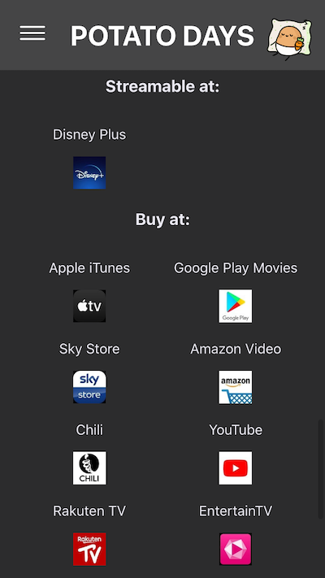
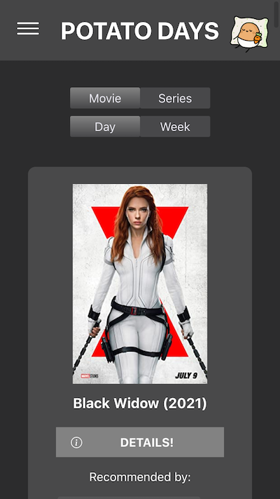
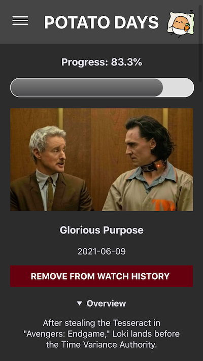

# Potato Days

### a guide for couch potatoes on potato days

I took part in a coding bootcamp focusing on Java development.
This is my capstone project.

It is easier to access movies and series than ever.
But whenever we actually get to have a couch potato day, we get overwhelmed by the choices and end up rewatching the same old shows.

_Potato Days_ can help you with that!

With _Potato Days_, you can save movie and tv show recommendations by friends, family, coworkers - or that random guy on the internet.
Once an item is on your watchlist, it can randomly appear on the landing page - or you can browse your whole list. :)
You can also browse trending shows and movies!

You can see all the details of movies and shows - posters, plots, length, production year, cast, crew members and even episodes.
I also included ratings and streaming availability (based in Germany).

Once you finally have some time off and get to be a couch potato, you can take a look at the list and hopefully find a good way to spend your time. :)

One you finished watching something, you can add it to your watch history. You can also see your progress in tv shows!

### Deployment

There is no need for you to clone the repository.
Check out _Potato Days_ [here](https://potatodays.herokuapp.com/)!

You might have to wait a bit for the server to start.
You also need to sign up to use the app.
There is no need to put personal information in there, but passwords are of course stored encrypted.

### Screenshots

### APIs used

I used a combination of [OMDb](https://www.omdbapi.com/),  and [TMBd](https://https://www.themoviedb.org/). While both are good APIs, the combination of both was just what I needed.